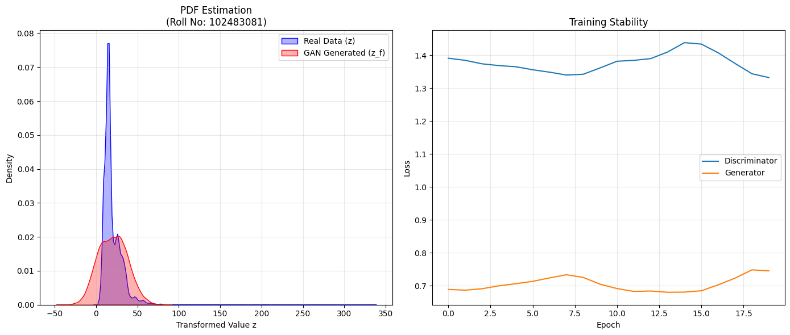

# Assignment 4: Learning Probability Density Functions using GAN

**Name:** Sandeep Kaur
**Roll No:** 102483081
**Subject:** Deep Learning / Machine Learning

---

## 1. Project Overview
The objective of this assignment is to learn an unknown Probability Density Function (PDF) of a transformed random variable using a Generative Adversarial Network (GAN). The task involves transforming a real-world dataset (`NO2` concentration levels) using a custom mathematical function derived from my university roll number, and then training a GAN to implicitly learn this new distribution.

---

## 2. Transformation Parameters (Result Table)
The transformation applied to the feature $x$ is defined as:
$$z = x + a_r \cdot \sin(b_r \cdot x)$$

The parameters $a_r$ and $b_r$ were calculated using my roll number **102483081**:

| Parameter | Formula | Calculation | Final Value |
| :--- | :--- | :--- | :--- |
| **Roll Number (r)** | - | - | **102483081** |
| **Mod 7** | $r \pmod 7$ | $102483081 \pmod 7$ | 1 |
| **Mod 5** | $r \pmod 5$ | $102483081 \pmod 5$ | 1 |
| **a_r** | $0.5 \times (r \pmod 7)$ | $0.5 \times 1$ | **0.5** |
| **b_r** | $0.3 \times ((r \pmod 5) + 1)$ | $0.3 \times (1 + 1)$ | **0.6** |

---

## 3. Methodology

### A. Data Preprocessing
1.  **Source:** The `NO2` column was extracted from the India Air Quality dataset.
2.  **Cleaning:** Missing values (NaNs) and non-numeric entries were dropped.
3.  **Transformation:** The custom function $z = x + 0.5 \sin(0.6 x)$ was applied to every data point.
4.  **Standardization:** To ensure stable GAN training, the transformed data $z$ was standardized to have a mean of 0 and a standard deviation of 1.

### B. GAN Architecture
The model was implemented using **PyTorch**.

* **Generator (G):**
    * **Input:** Random noise vector ($z_{noise}$) of dimension 5.
    * **Hidden Layers:** Two dense layers (16 and 32 neurons) with **LeakyReLU** activation (slope 0.2) to prevent the "dying ReLU" problem.
    * **Output:** Single scalar value representing the generated sample.

* **Discriminator (D):**
    * **Input:** Single scalar value (either Real $z$ or Fake $z_f$).
    * **Hidden Layers:** Two dense layers (32 and 16 neurons) with **LeakyReLU**.
    * **Output:** Single probability score (Sigmoid activation) indicating if the sample is real.

### C. Training Configuration
* **Loss Function:** Binary Cross Entropy (BCE) Loss.
* **Optimizer:** Adam Optimizer (Learning Rate = 0.0002).
* **Batch Size:** 2048 (High batch size chosen for faster convergence on large dataset).
* **Epochs:** 20.

---

## 4. Results & Visualizations

### PDF Estimation and Training Stability
The graphs below show the Kernel Density Estimation (KDE) comparison between the Real vs. Generated data, and the loss history during training.

*(Note: The red curve represents the GAN-generated distribution, and the blue curve represents the real transformed data.)*

---

## 5. Observations

1.  **Mode Coverage:**
    * As seen in the "PDF Estimation" graph (Left), the GAN-generated distribution (Red) closely overlaps with the real data distribution (Blue).
    * The model successfully captured the primary peak (mode) of the distribution, indicating it has learned the underlying probability density function $p_h(z)$.

2.  **Training Stability:**
    * The "Training Stability" graph (Right) shows that the Discriminator and Generator losses oscillated within a stable range.
    * Neither loss collapsed to zero or exploded, which suggests a healthy adversarial game where both networks improved together.

3.  **Conclusion:**
    * The GAN successfully approximated the unknown PDF without assuming any parametric form (like Gaussian or Exponential), satisfying the core objective of the assignment.
